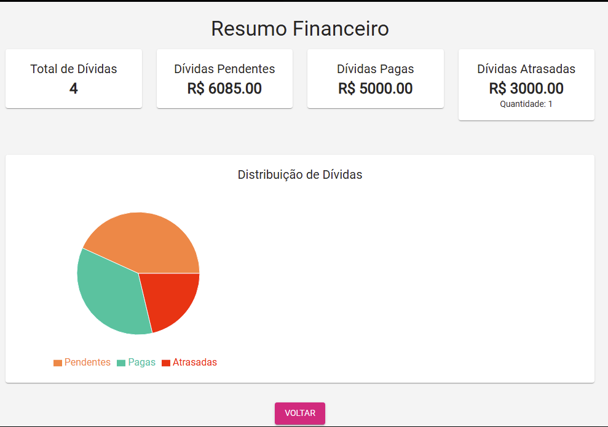
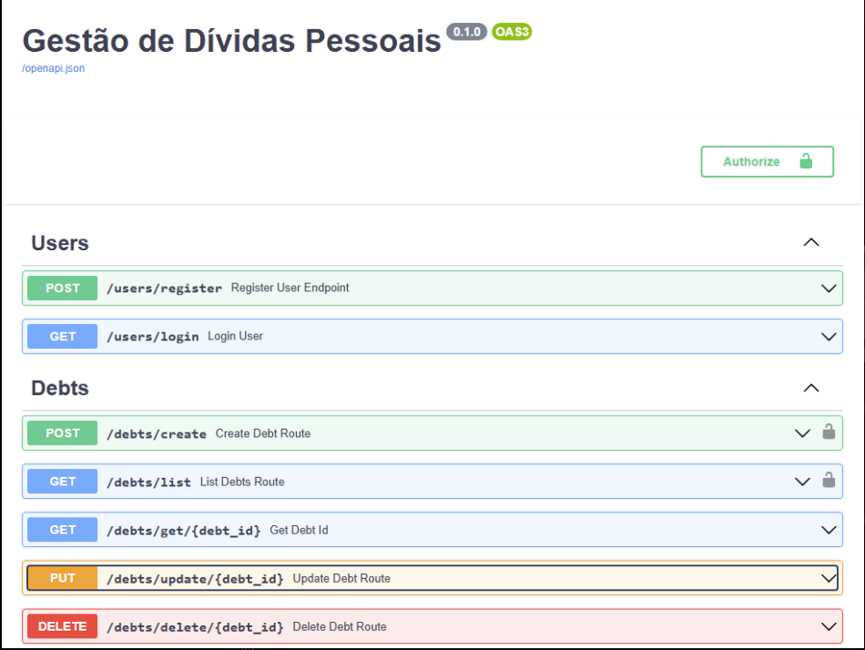
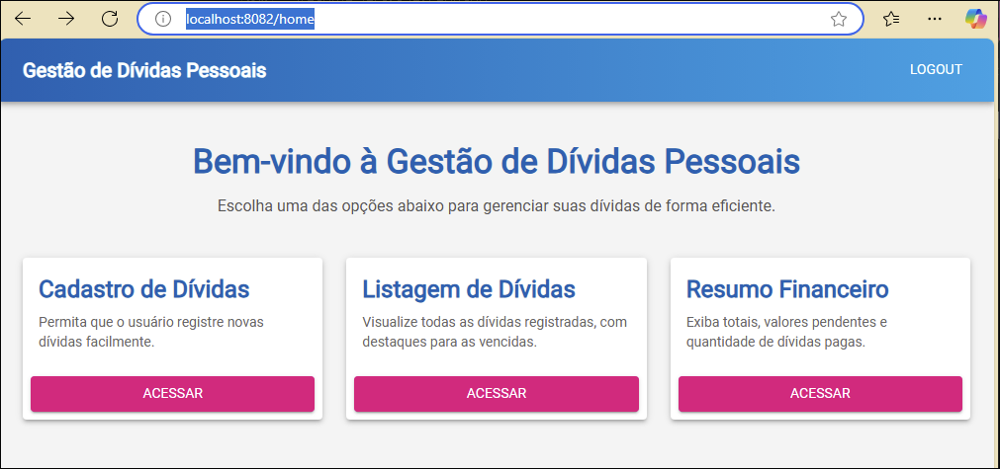

# Gestão de Dívidas Pessoais

## Visão Geral
Este é um projeto de gestão de dívidas pessoais, desenvolvido para ajudar os usuários a organizarem melhor suas vidas financeiras. O sistema permite:
- Cadastro de novas dívidas
- Listagem de todas as dívidas registradas
- Edição e exclusão de dívidas
- Visualização de um painel de resumo financeiro

## Tecnologias Utilizadas

| Tecnologia    | Versão   | Marca                                      |
|---------------|----------|--------------------------------------------|
| Python        | 3.11     |  |
| FastAPI       | 0.95.2   |  |
| React         | 18.2.0   |  |
| TypeScript    | 4.9.5    |  |
| Material-UI   | 5.11.15  |  |

## Estrutura do Projeto

### Backend
```
backend/
├── app/
│   ├── controllers/
│   ├── dto/
│   ├── models/
│   ├── services/
│   ├── configurations/
│   └── main.py
├── .env
└── requirements.txt
```

### Frontend
```
frontend/
├── public/
├── src/
│   ├── components/
│   ├── pages/
│   ├── services/
│   ├── styles/
│   └── App.tsx
├── package.json
└── tsconfig.json
```

## Como Executar o Projeto

### Backend
1. Certifique-se de ter o Python 3.11 instalado.
2. Clone o repositório e navegue até o diretório `backend`.
3. Instale as dependências:
   ```bash
   pip install -r requirements.txt
   ```
4. Configure o arquivo `.env` com as variáveis de ambiente necessárias.
5. Execute o servidor:
   ```bash
   uvicorn app.main:app --reload
   ```
6. Acesse a documentação interativa em [http://127.0.0.1:8000/docs](http://127.0.0.1:8000/docs).

### Frontend
1. Certifique-se de ter o Node.js e o npm instalados.
2. Navegue até o diretório `frontend`.
3. Instale as dependências:
   ```bash
   npm install
   ```
4. Execute o servidor de desenvolvimento:
   ```bash
   npm start
   ```
5. Acesse a aplicação em [http://localhost:3000](http://localhost:3000).

## Funcionalidades
- **Cadastro de Dívidas**: Inclua título, valor, data de vencimento, status e observações.
- **Listagem de Dívidas**: Visualize todas as dívidas cadastradas com destaque para as atrasadas.
- **Resumo Financeiro**: Painel com total de dívidas cadastradas, valor total de dívidas pendentes, quantidade de dívidas pagas e atrasadas, com visualização gráfica.
- **Autenticação**: Registro e login com token JWT.

## Exemplos Visuais

## Resumo Financeiro


### Swagger - Documentação da API


### Tela Inicial



## Contato
Em caso de dúvidas ou sugestões, entre em contato pelo e-mail: m4r6i0@gmail.com.
